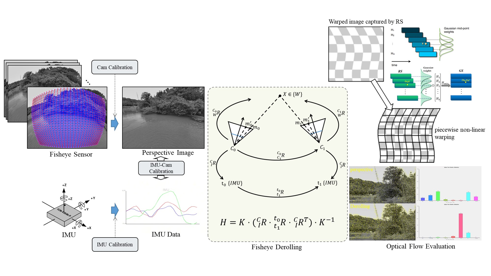
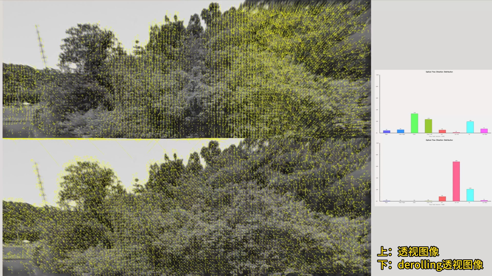
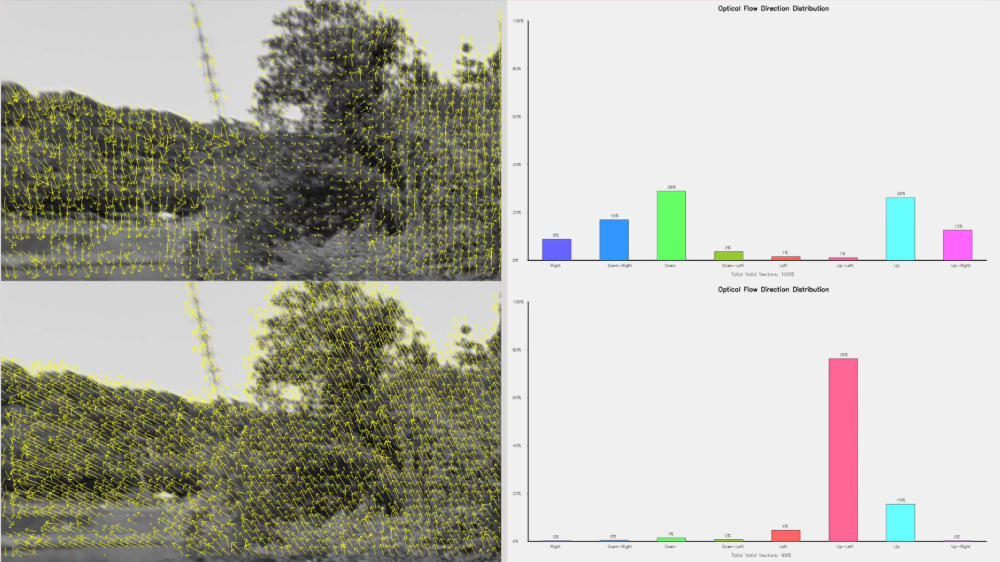

# Fisheye Derolling

关键技术：Image Warping, Homography mixtures, Camera and Gyroscope Calibration

youtube：https://youtube.com/watch?v=HA7zeKJliek

Credits:

[Digital video stabilization and rolling shutter correction using gyroscopes](https://www.researchgate.net/profile/Dr-Asutosh-Kar/post/How_can_I_stabilize_video_images_in_real_time/attachment/59d631f8c49f478072ea150a/AS%3A273628971634709%401442249638508/download/Reference-2.pdf)

[Calibration-free rolling shutter removal](https://www.researchgate.net/publication/254038103_Calibration-free_rolling_shutter_removal)

